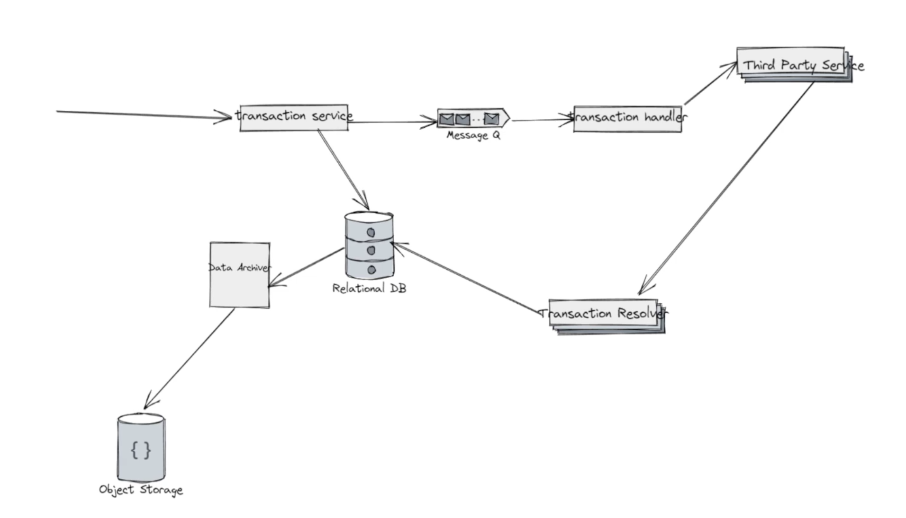

# Banking Ledger System Design

## Design



There are some issues I see with this proposed design. Having the transaction service place 
the transaction in the DB followed by the resolver updating may lead to a confusing design. What if the
user makes a deposit but the message goes into the DLQ? Does the user try again because they really need
the balance reflected immediately? What about deposits having similar issues? This leads me to believe that
we may have been better off making an HTTPS call to the transaction service which then uses REST/gRPC to make
service to service calls. I would also consider an in-memory database (redis) for fast viewing of account balances
when the user initially logs in. This could be done via CDC or a cron job between the DBs.

## Assumptions
* Assume frontend client exists / ATM \[Multiple sources of transactions e.g.: paypal, zelle, direct deposits/checks\]
* List expectations in term of requests
* https://blog.bytebytego.com/p/payment-system

## Functional Requirements
* User sign-up. Opening a new bank account.
  * Users already exist. We do not need to make sure we're authenticating the users properly
* Deposits
  * Cash deposit / Check deposit
  * Auto deposit (payroll, etc)
  * Paypal, Zelle, etc
  * [Reconciliation] Internal API \[External facing endpoint]
* Withdrawals
  * Cash withdrawal
  * Checks
  * Pre-authorized
  * Wire transfers
  * Third party applications
* Users viewing their balance
* Joint accounts (out of scope)
* Transaction history
* Disputes [Security, Regulation [Tax, Reporting [Tax, Reporting, and Auditing], and Auditing], and Compliance]
* Fraud
* ACID compliant database
  * postgres (better for concurrency), mysql

## Non-Functional Requirements
* Security, privacy, only authorized parties
* Strong consistency
  * No partial transactions
  * Immediate vs eventual
    * Eventual consistency with respect to balance
    * Strong consistency - no partial transaction
* Highly available

## Scale of the transaction
* Assume in millions of users, cost irrelevant
* Think about api design and how you would make this a global design

## API Design

### Authentication
* Web tokens (lightweight)
  * Short lived (~5m)
* 2FA => 

POST v1/generate_token/:account_id

PUT is better to use because if the token is already there, it will return the same token with expiration

request: 
```
{
   "username",
   "password"
}
```
```
{
   "token",
   "expirationTimestamp"
}
```
```
{
   "token"
   "type": "refresh"
}
```

response: 
```
{
   status_code: ...
}
```

### Viewing balance
GET /v1/balance?accountId={}

### Database Entities
* User
  * username
  * email
  * address
* Account
  * accountId
  * type: check / savings
* UserAccount => Many-to-many relationship
  * userId
  * accountId
* Transaction
  * transactionId
  * type: withdrawal, deposit, etc
  * amount
  * accountId

#### Scale of database
* Relational database
* Global design leads to sharding
  * shard by userId
* Replication => Primary (with multiple followers) => Replicas 
* If user logs in from non-primary location, some kind of data replication will need to happen the first time for the region
  * Compliance comes into play here because of different regional regulations


