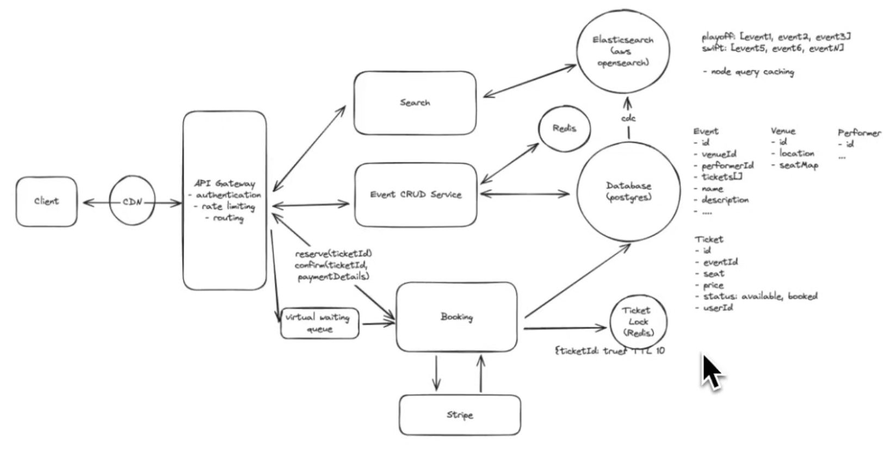

# Ticketmaster System Design

## Requirements

### Functional Requirements
* Features of the system that are core to it
* Book tickets
* View an event
* Search for events

### Non-Functional Requirements
* Qualities of the system
  * Think about scalability, availability, reliability, fault tolerance, CAP, etc. context
* Low latency search
* consistency > availability (no double booking)
  * Can coexist in different parts of system
  * Strong consistency for booking tickets & high availability for search and viewing events
* read > write
* scalability to handle surges from popular events

### Out of scope
* GDPR compliance
* fault tolerance
* etc.
* Think about reprioritizing once requirements are set to determine if any requirements should fall out of scope and vice versa

## Core Entities & API
* Think about what data is persisted and used by APIs

### Core Entities
* Event
* Venue
* Performer
* Ticket

### API
* Create APIs to satisfy functional requirements and exchange core entities
* GET /event/:eventId -> Event & Venue & Performer & Ticket[]
* GET /search?term={term}&location={location}&type={type}&date={}... -> Partial\<Event\>[]
* POST /booking/reserve
  * header: JWT | sessionToken
  * { body: ticketId }
* POST /booking/confirm
  * header: JWT | sessionToken
  * { body: ticketId, paymentDetails (stripe) }

## High-Level Design
* Client reaches API Gateway 
* API Gateway routes to correct microservice
* GET /event/:eventId
  * First hits api gateway
  * Routed to Event CRUD Service
  * Service can then read off database which stores core entities
  * Opt for postgres for ACID properties
    * Think about qualities of database for SQL vs NoSQL
* GET /Search?...
  * Search service
  * Read off database for simple querying
  * COME BACK TO THIS SINCE IT IS INEFFICIENT
* POST /booking/reserve
  * Booking service
  * Update database for ticketId
  * Stripe as payment processor which responds via webhook to update ticket
  * Distributed lock with TTL for tickets getting reserved until booked
    * This can be used with search to cross-reference reserved tickets when returning initial tickets
    * Used as a distributed lock so that we can horizontally scale instead of in memory
    * If lock goes down, detect and bring it up
      * Can add a check on database for status, whoever submits first wins

## Deep Dive
* Need a search optimized database instead of slow relational searches
* Elasticsearch can build inverted index to make searching documents by term quick
  * Tokenizes strings and then mapped to work
  * CDC to elasticsearch allows for fast searches when events change
  * Consider queues for heavy writes since Elasticsearch will be limited by reindexes
* CDN can cache frequently used API calls such as surge in a same search term
* Surge of traffic for an event can cause slowdown
  * Long polling, websocket to  wait for response
  * Server sent events (SSE) as long as connection remains open for client
    * Unidirectional (server to client only)
  * Can still have tickets completely booked immediately before some users can react
    * Can introduce virtual waiting queue as a choke point that users enter first
* Scaling system considerations
  * API Gateway has own load balancer
  * Scaling servers on memory or cpu consumption
  * Sharding databases based on usage (QPS math)
* Can reduce read load on event database for views by adding cache (redis)
