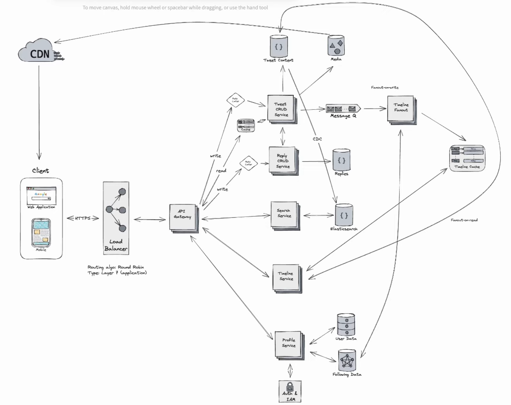

# Twitter System Design

## Design

## Requirements

### Functional Requirements
* Users should be able to create, edit, delete tweets
* Users should be able to like, retweet, and reply to tweets
* Users should be able to search for tweets
* Users should be abel to view tweets from users they follow on their homepage
* Users should be able to create an account and log in
* Users should be able to follow other users

## General Notes

### Client
* Client represents all requests sent (web, mobile, etc...)
* Client calls will hit the load balancer which is key to scalability
  * Routing algorithm determines how requests are distributed
    * Round robin - good for stateless connections
    * Least connections
  * Important to determine layer that load balancer will operate at
    * Layer 4: transport layer (e.g.: TCP)
    * Layer 7: Application layer (e.g.: HTTPS). Routes based on content like url and HTTP headers
### Load Balancer
* Load balancer distributes traffic to fleet of servers that serve as API Gateway
  * Good for microservice architecture that communicates with one another
  * Takes incoming request from load balancer and forwards on to appropriate service

### API Gateway
* Services that API gateways forwards to are based on functional requirements

### Services
* When creating services, think if they need to be scaled independently
  * Tweet CRUD service
  * Reply CRUD service
  * Search service
  * Timeline service
  * Profile service
* Go through services to determine if each one is capable of fulfilling requirements

#### Tweet Service
  * Functional
    * Create, edit, & delete
    * Likes & retweets
    * Store metadata
  * Non-Functional
    * High throughput because these are the most frequent operations
  * Tweet content database is NoSQL based 
    * Good for performance efficiencies since Twitter requires rapid read and write operations
    * No complex joins
    * JSON document storage
  * Media stored in blob storage like S3 for performance
  * Rate limiter for excessive read/write protection and bot protection
* Cache on read path for popular tweets (e.g.: Redis)
* CDN for geographic performance boost on tweet content

#### Reply Service
  * Stored in separate data store
    * This is done for scaling replies independently
    * Can scale replies faster than tweets since mostly see replies
  * Rate limiter on write path to limit bots
  * Index reply db by tweet id so they can be bundled with initial tweet to make it faster

#### Search Service
  * Elasticsearch for fast full text search
    * CDC from tweet content document store to elasticsearch
  * Reverse index on tweet content, username, hashtags

#### Timeline Service
  * Fanout-on-read vs fanout-on-write
  * With fanout-on-read we query list of accounts they follow, request tweets, sort, and return
    * Slow and expensive
  * With fanout-on-write, we can update asynchronously
    * On new tweets, place on a message queue that acts as buffer
    * Workers look at queue and request followers for tweeter
    * Followers can have a timeline cache that holds recent tweets from who they follow
    * Workers can then prepend new tweets to the follower's timeline cache
    * This is more write intensive but reading is much faster thus prioritizing read speed
  * For users with millions of followers we can lean on fanout-on-read since it is much more intensive
  * A hybrid approach is fanout-on-write but also checking the high profile followers when retrieving data

#### Profile Service
  * Opt for traditional relational database
  * Allows for efficient querying of structured user data while adhering to ACID (atomicity, consistency, isolation, durability)
  * Also good for complex joins 
  * GraphDB for follower tracking as it is tailored for mapping out networks
    * Good for recommendation systems, new followers
  * Auth & IAM are seperated for tighter security and flexibility for integrating into other services without mixing with main user logic

### Security, Monitoring, & Testing

#### Security
* Authentication & Authorization handled by auth service
* Encryption 
  * HTTPS for data that is in transit between client and server
  * Data at rest is encrypted by database
* Rate limiting
  * IP rate limiting with API gateway for DDOS attacks
* Input validation on client for sql injection, XSS, or other malicious attacks (also done on server)

#### Monitoring
* Health checks to know when a service goes down immediately or monitor performance
* Logging done via ELK
  * Elasticsearch will store logs
  * Logstash will process them
  * Kibana will provide visual interface to analyze logs
  * All services will have a link to this component
* Realtime alerts to know when a service is in a bad state
  
#### Testing
* Load testing new services to see how they hold up or may be bottlenecks
* Automated testing done via CI/CD (unit tests, integration tests)
* Backup data regularly & recovery process for restorations